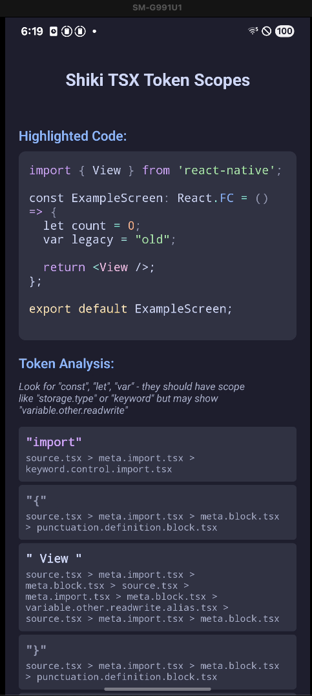

# react-native-shiki-typescript

Reproduction for TSX/TypeScript syntax highlighting issue with `react-native-shiki-engine`.

## Issue

The native Oniguruma engine in `react-native-shiki-engine` produces incorrect token scopes for TSX/TypeScript. Keywords like `const`, `let`, and `var` get assigned `variable.other.readwrite.tsx` instead of `storage.type.tsx` or `keyword`.

**Expected:** `const` should have scope `storage.type.tsx`
**Actual:** `const` gets scope `variable.other.readwrite.tsx`

The web version using the JavaScript regex engine highlights correctly.



## Setup

```bash
npm install
npx expo run:ios   # or npx expo run:android
```
